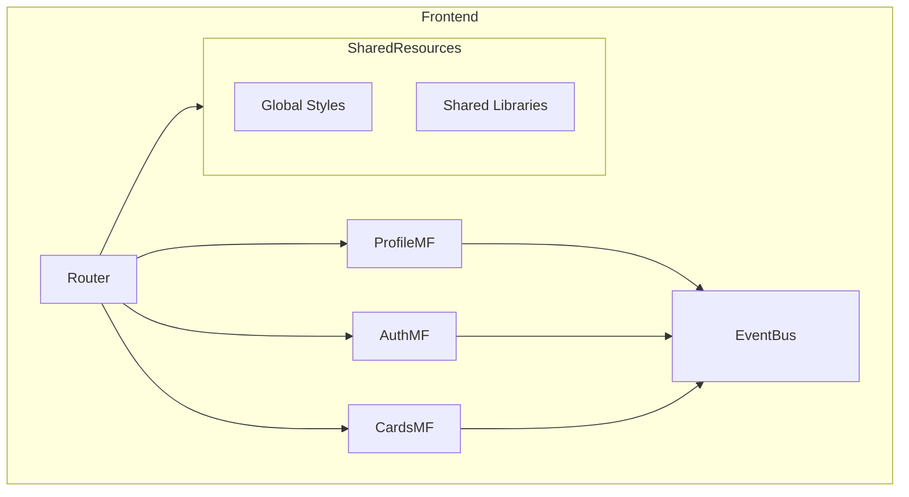
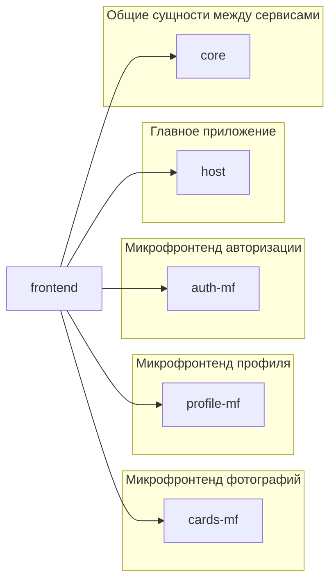

# Разбивка монолитного фронтенда на микрофронтенды

## Проектирование



Самым оптимальным способом будет разбивка на следующие микрофронтенды, которые будут управляться разными командами независимо друг от друга, но с возможностью слушать общую шину событий (`Event Bus`):

- микрофронтенд управления карточками `CardsMF`;
- микрофронтенд управления авторизацией `AuthMF`;
- микрофронтенд управления профилем `ProfileMF`.
  Также будет команда поддержки главного (`host`) приложения, которое будет обьединять в себе все микрофронты воедино.
  Микрофронтенды могут между собой общаться посредством шины событий (`Event Bus`) подписываясь на определенный полезные для доменной области события, также дополнительно можно будет воспользоваться глобальным состоянием (например, `Redux`, `MobX`, `Zustand` и прочие), чтобы иметь доступ к данным определенного микрофронта, например, проверка статуса авторизации пользователя на определенных роутах или извлечение данных пользователя.

Для реализации будет использоваться библиотека `React` (по-крайней мере первое время, во время разбивки, в дальнейшем, любая команда может перейти на удобный для себя фреймворк).

Метод реализации - клиентский, так как для взаимодействия с сервисом потребуется пройти авторизацию и рендеринг страницы на стороне сервера для `SEO` не требуется (если же в будущем потребуется открыть некоторые динамические страницы наружу, то можно будет перестроить систему сборки на гибридную).

В качестве компановщика модулей будет выступать `Webpack Module Federation`, реализовывать будем клиентскую конфигурацию сборщика.

> Общими компонентами будут - `react`, `react-dom` и `react-router-dom`

### Общие стили и ресурсы

`SharedResources` - модуль, который содержит в себе общие библиотеки, переиспользуемые между микрофронтендами, а также стили, использующие единую дизайн систему.

### Микрофронтенд для работы с фотографиями

`CardsMF` - модуль, который будет отвечать за работу с галереей
**Функционал:**

- добавлять карточку;
- удалять карточку;
- рендеринг карточки;
- управление лайками карточки.

### Микрофронтенд для работы с авторизацией

`AuthMF` - модуль отвечает за авторизацию на сервисе
**Функционал:**

- авторизация;
- регистрация;
- выход.

### Микрофронтенд для работы с профилем

`ProfileMF` - модуль отвечающий за отображение профиля на странице
**Функционал:**

- редактировать данные пользователя;
- обновлять аватарку;
- получение данных пользователя.

## Планирование изменений



### Общие сущности

Общие сущности, которые можно будет импортировать в разные микрофронтенды и переиспользовать:

- `components` - общие компоненты (например, попап);
- `icons` - общая база иконок;
- `utils` - общие утилиты (на данный момент будет только `api.js`, со временем, после разделения бекенда на `BFF` слои, каждый микрофронтенд будет иметь свой слой `BFF` и данный файлик распределится по микрофронтам, оставив только базовый класс для формирования запросов к бекенду);
- `images` - общие картинки.

#### Структура компонента

- `hooks` - в данной папке будет храниться бизнес логика конкретного компонента;
- `styles.module.css` - модульный файл стилей компонента;
- `index.tsx` - главный файл компонента с разметкой `JSX`.

```
/core
	/components
	  /Popup                 // Общий компонент попапа
		/hooks               // Бизнес логика показа
			  usePopup.js
		index.jsx
		styles.module.css
	  /Tooltip               // Общий компонент всплывающего уведомления
		/hooks               // Бизнес логика показа
			useTooltip.js
		index.jsx
		styles.module.css
	/images                  // Общие картинки
	/utils
	  api.js                 // Общее API для профиля и галереи
	/icons                   // Общие иконки
	/hooks
		useEventBus.js       // Общая шина событий
```

### Главное приложение

Главное (`host`) приложение содержит в себе маршрутизацию между микрофронтендами, предоставляет единый интерфейс для общения между микрофронтами (`Event Bus`), а также глобальное хранилище состояния приложения.
Главный хост реализует в себе общие сущности:

- `шапка сайта` - включает в себя компоненты от микрофронтенда профиля и авторизации (почта и разлогин);
- `подвал сайта`;
- `маршрутизация` (например, `React Router`)
  - страница авторизации
  - страница регистрации;
  - страница галереи.
- `содержимое страниц`.
  Файловая структура проекта:
- `components` - компоненты, характерные хосту (шапка, подвал);
- `pages` - содержит компоненты страниц приложения;
- `router` - данные по маршрутизация в приложении;
- `index.tsx` - файл, с которого стартует приложение (`bootstrap`).

```
/host
  /src
    /components
		/Header                 // Компонент шапки, включает в себя компоненты микрофронтендов: авторизации и профиля (отображение почты)
		  index.jsx
		  styles.module.css
		/Footer                 // Компонент подвала сайта
		  index.jsx
		  styles.module.css
		/ProtectedRoute         // Компонент роута, разрешающий доступ только авторизованным пользователям
		  index.jsx
    /pages
		/LoginPage              // Страница авторизации
			index.jsx
			styles.module.css
		/RegisterPage           // Страница регистрации
			index.jsx
			styles.module.css
		/CardsPage              // Страница галереи
			index.jsx
			styles.module.css
    /router                     // Маршрутизация
		index.js
    index.js                    // Точка входа хоста
  package.json                  // Зависимости и скрипты микрофронтенда
  webpack.config.js
```

### Микрофронтенд авторизации

Данный микрофронтенд будет отдавать компоненты - регистрации, авторизации и разлогина, а также бизнес логику связанную с ними (состояние авторизации).

```
/auth-mf
  /src
    /components
		/Login                  // Компонент авторизации
			index.jsx
			styles.module.css
		/Logout                 // Компонент разлогина
			index.jsx
			styles.module.css
		/Register               // Компонент регистрации
			index.jsx
			styles.module.css
    /hooks
		useAuth.js              // Бизнес логика авторизации
	/utils
		auth.js                 // Взаимодействие с API авторизации
  package.json                  // Зависимости и скрипты микрофронтенда
  webpack.config.js
```

### Микрофронтенд профиля

Данный микрофронтенд будет отдавать компоненты - данные пользователя (аватарка, имя и занятие) и форму профиля.
Также контекст текущего профиля и бизнес логику по профилю (хук получения информации по текущему профилю).

```
/profile-mf
  /src
    /components
		/Profile                      // Компонент отображения профиля
			/ProfileForm              // Компонент формы изменения профиля
				/hooks
					useProfileForm.js // Бизнес логика формы профиля
			    index.jsx
			    styles.module.css
		  index.jsx
		  styles.module.css
		/Avatar                       // Компонент отображения аватара
			/AvatarForm               // Компонент формы изменения аватара
				/hooks
					useAvatarForm.js  // Бизнес логика формы смены автарки
			    index.jsx
			    styles.module.css
		  index.jsx
		  styles.module.css
    /contexts
		CurrentUserContext.js         // Контекст профиля (хранит информацию по пользователю)
	/hooks
		useProfile.js                 // Бизнес логика профиля
  package.json                        // Зависимости и скрипты микрофронтенда
  webpack.config.js
```

### Микрофронтенд для работы с фотографиями

Данный микрофронтенд будет отдавать компоненты - данные пользователя (аватарка, имя и занятие) и форму профиля.
Также контекст текущего профиля и бизнес логику по профилю (хук получения информации по текущему профилю).

```
/cards-mf
  /src
    /components
		/Cards                        // Компонент отображения карточек
			/hooks
				useCards.js           // Бизнес логика карточек
			index.jsx
			styles.module.css
		/Card                         // Компонент отображения карточки
			/CardForm                 // Компонент формы добавления карточки
				/hooks
					useCardForm.js    // Бизнес логика формы карточки
			    index.jsx
			    styles.module.css
			/hooks
				useCard.js            // Бизнес логика карточки
		    index.jsx
		    styles.module.css
  package.json                        // Зависимости и скрипты микрофронтенда
  webpack.config.js
```
